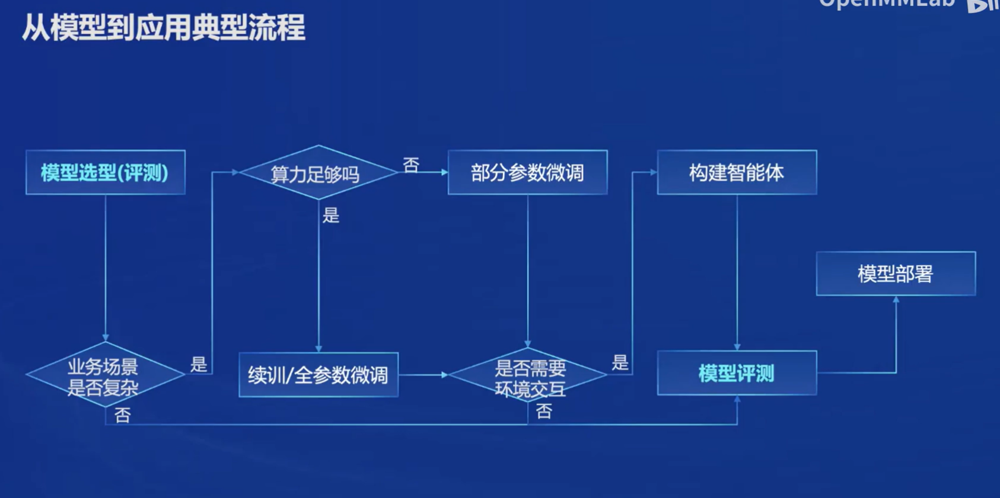

# Lec1 书生·浦语大模型全链路开源体系

## InternLM2 体系

参数量级：7B vs 20B，研究场景与应用场景

InternLM2-Base：基座模型，可提供给社区用于二次微调开发；
InternLM2：可用于应用构建的基座模型；
InternLM2-Chat：经过SFT以及RLHF，面向对话聊天进行优化；

重视数据集的重要性，数据类型、种类范围要大。

优秀点：指令跟随、工具调用。

## 二次开发流程

数据、预训练、微调、智能体（应用）、部署：
+ 数据：书生万卷数据集；
+ 预训练：与 Hugging face、deepspeed 进行对比；
+ 微调：增量续训（垂直领域）、有监督微调（对话等）；提出 XTuner 框架，对比 PEFT；
+ 评测：OpenCompass；
+ 部署：LMDeploy；
+ 智能体：Lagent 框架，了解比较少，以后可以多了解一下实现方案；

