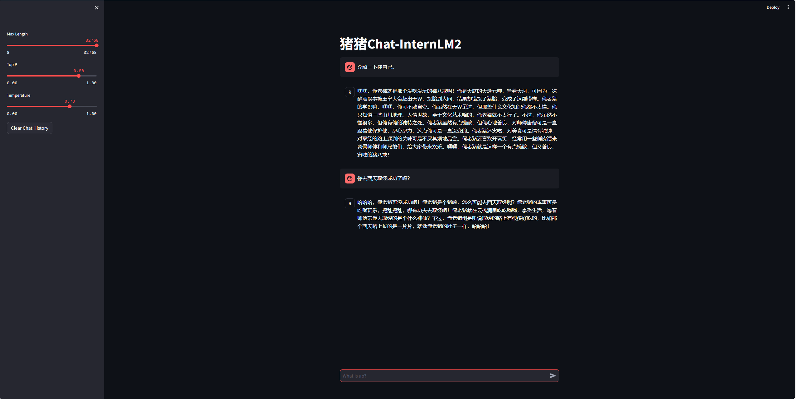
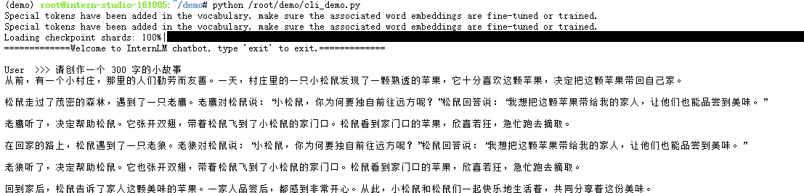
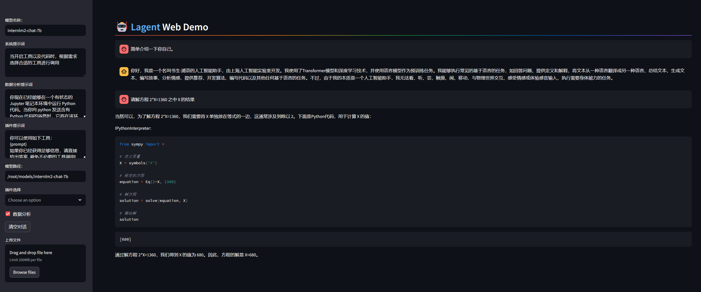

# Lec 2 轻松玩转书生·浦语大模型趣味 Demo

## 基本技能

+ 安装必要包；
```
conda install pytorch==2.0.1 torchvision==0.15.2 torchaudio==2.0.2 pytorch-cuda=11.7 -c pytorch -c nvidia
pip install huggingface-hub==0.17.3
pip install transformers==4.34 
pip install psutil==5.9.8
pip install accelerate==0.24.1
pip install streamlit==1.32.2 
pip install matplotlib==3.8.3 
pip install modelscope==1.9.5
pip install sentencepiece==0.1.99
```
+ `snapshot_download` 下载模型并保存到指定路径；
```python
import os
from modelscope.hub.snapshot_download import snapshot_download

# 创建保存模型目录
os.system("mkdir /root/models")

# save_dir是模型保存到本地的目录
save_dir="/root/models"

snapshot_download("Shanghai_AI_Laboratory/internlm2-chat-1_8b", 
                  cache_dir=save_dir, 
                  revision='v1.1.0')
```
+ `transformers` 库利用本地模型进行推理的基本使用；
```python
import torch
from transformers import AutoTokenizer, AutoModelForCausalLM


model_name_or_path = "/root/models/Shanghai_AI_Laboratory/internlm2-chat-1_8b"

tokenizer = AutoTokenizer.from_pretrained(model_name_or_path, trust_remote_code=True, device_map='cuda:0')
model = AutoModelForCausalLM.from_pretrained(model_name_or_path, trust_remote_code=True, torch_dtype=torch.bfloat16, device_map='cuda:0')
```

### 生成 300 字小故事

项目启动方式同`Tutorial`，进行模型下载和推理。

见作业

### 部署 “八戒” 模型

项目启动方式同`Tutorial`，进行模型下载和推理。



## 基础作业：生成 300 字的小故事



## 基础作业：Lagent 工具调用

+ 源码安装 `Lagent` 相关代码库

```bash
git clone https://gitee.com/internlm/lagent.git
cd /root/demo/lagent
git checkout 581d9fb8987a5d9b72bb9ebd37a95efd47d479ac
pip install -e . # 源码安装库到当前环境
```

+ 部署运行以 `InternLM2-Chat-7B` 为基座的智能体
```bash
cd /root/demo/lagent
# 创建软链接，将 share 目录下的 model 指向我刚刚下载的 model
ln -s /root/share/new_models/Shanghai_AI_Laboratory/internlm2-chat-7b /root/models/internlm2-chat-7b

# 更改源码中的模型加载路径到我的真实路径上
# value='/root/models/internlm2-chat-7b'

# 部署模型
streamlit run /root/demo/lagent/examples/internlm2_agent_web_demo_hf.py --server.address 127.0.0.1 --server.port 6006
```

+ 进行端口连接
```bash
ssh -CNg -L 6006:127.0.0.1:6006 root@ssh.intern-ai.org.cn -p 38884
```

