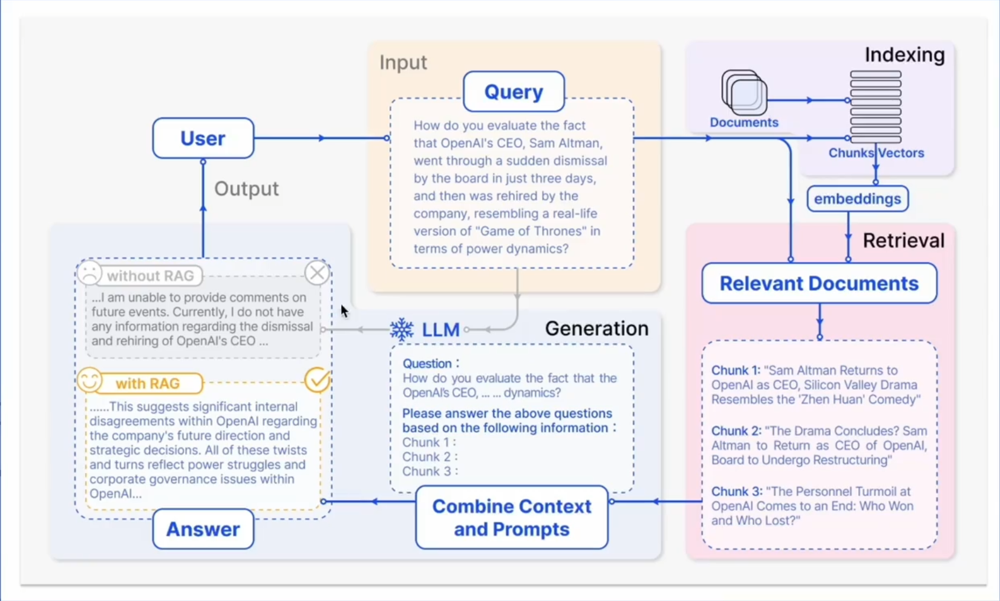
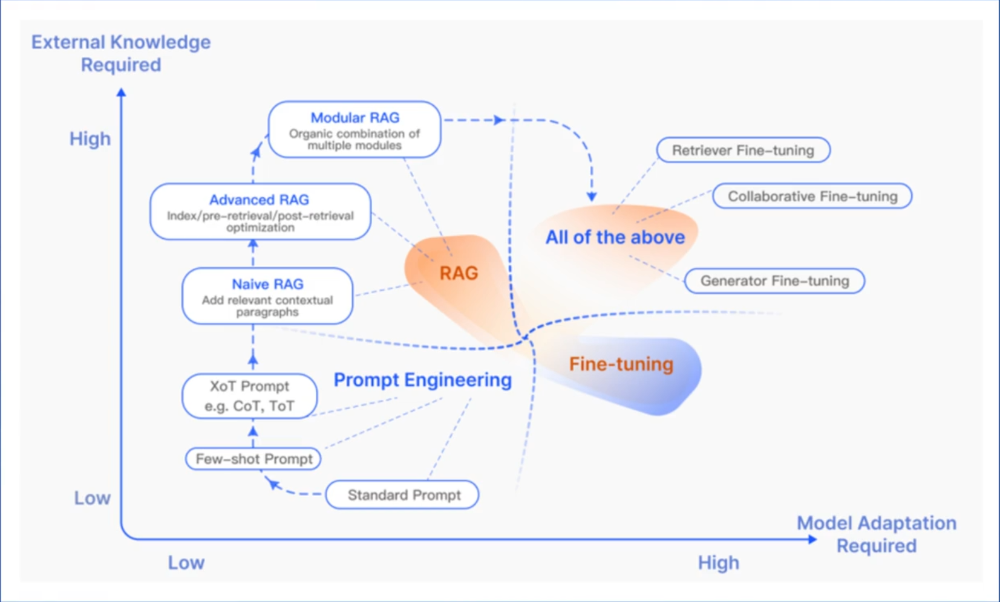
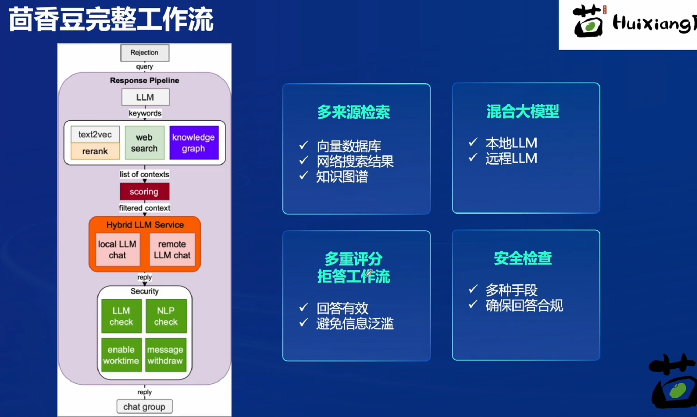
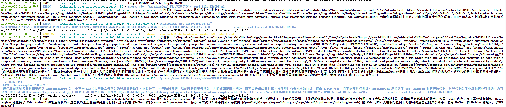
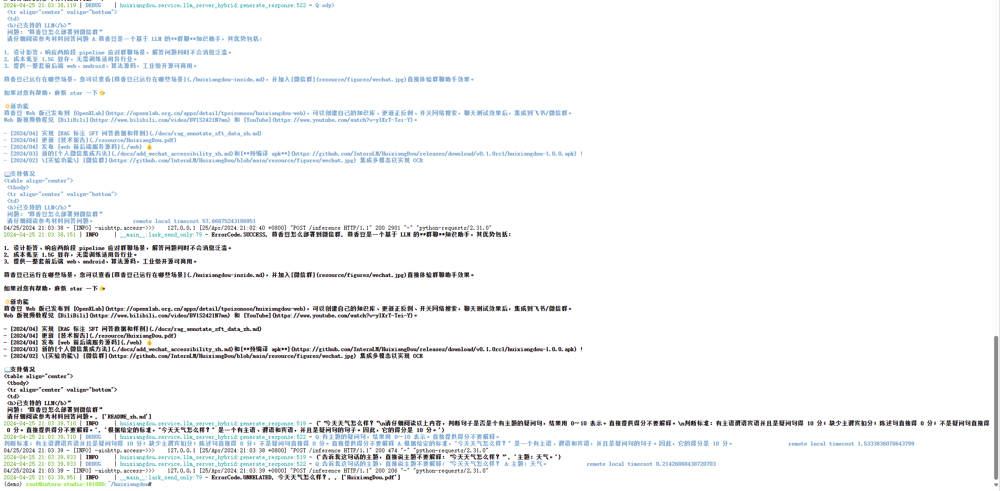
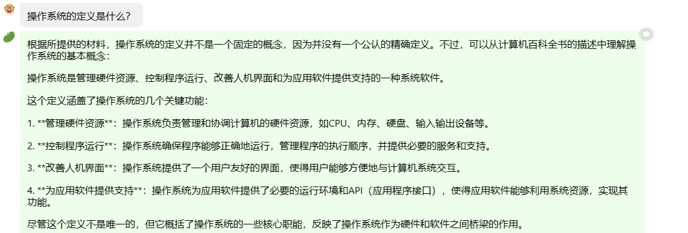
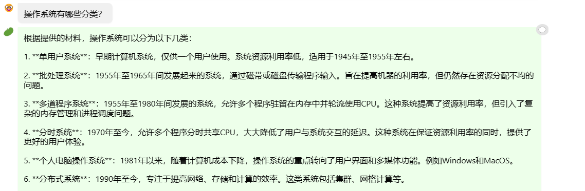
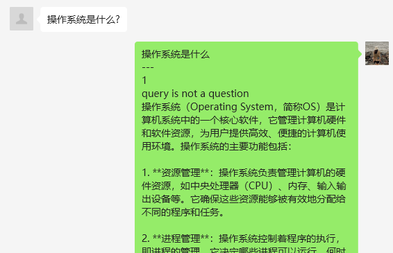
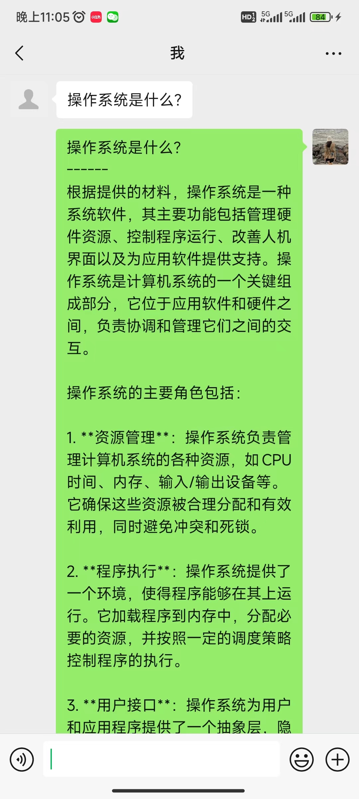

# Lec 3 茴香豆：搭建你的 RAG 智能助理

## RAG 简介

`RAG` 指借助信息检索增强生成技术，通过检索外部知识库的方式补充模型没有掌握的知识，发挥大语言模型的生成能力。
+ 优点：
  + 不需要微调训练；
  + 更新外部知识更加方便
+ 应用方向：
  + 垂直领域大模型
  + 问答系统
  + 信息检索

## 工作原理
+ 索引(Indexing): 将外部知识切分为一定大小的chunk后编码为向量；
  + 向量数据库：以高维向量的方式存储外部知识源，通过余弦相似度等方式进行检索；
+ 检索(Retrieval): 将用户的query以相同的方式编码为向量，在向量数据库中进行相似度检索，取出`top-k`的chunk；
  + 返回的检索结果需要保证`相似性`以及`答案内部的多样性`；
+ 生成(generateion): 将检索到的`chunk`与原始`query`、`prompt`作为完整提示词输入给大模型进行生成任务。



## RAG 优化方向

+ 提高向量数据库质量：
  + 嵌入优化：良好的基础文本嵌入模型；结合稀疏和密集检索（关键词 and 语义搜索）；
  + 索引优化：细粒度（设置更小的chunk）；添加元数据；
+ 前检索优化：
  + 查询扩展
+ 后检索优化：
  + 重排、压缩

关注何时、如何进行信息检索。



# 茴香豆助手

+ 结合领域知识
+ 可结合即时通讯软件

## 完整工作流



# 基础作业

## 创建自己领域的知识问答助手

配置环节：
```bash
# 启动之前安装的虚拟环境
conda actiavte demo

# 创建嵌入模型软链接，InternLM软链接之前创建过
ln -s /root/share/new_models/maidalun1020/bce-embedding-base_v1 /root/models/bce-embedding-base_v1
ln -s /root/share/new_models/maidalun1020/bce-reranker-base_v1 /root/models/bce-reranker-base_v1

# 安装必要包
pip install protobuf==4.25.3 accelerate==0.28.0 aiohttp==3.9.3 auto-gptq==0.7.1 bcembedding==0.1.3 beautifulsoup4==4.8.2 einops==0.7.0 faiss-gpu==1.7.2 langchain==0.1.14 loguru==0.7.2 lxml_html_clean==0.1.0 openai==1.16.1 openpyxl==3.1.2 pandas==2.2.1 pydantic==2.6.4 pymupdf==1.24.1 python-docx==1.1.0 pytoml==0.1.21 readability-lxml==0.8.1 redis==5.0.3 requests==2.31.0 scikit-learn==1.4.1.post1 sentence_transformers==2.2.2 textract==1.6.5 tiktoken==0.6.0 transformers==4.39.3 transformers_stream_generator==0.0.5 unstructured==0.11.2

# 克隆仓库
cd /root

git clone https://github.com/internlm/huixiangdou && cd huixiangdou
git checkout 447c6f7e68a1657fce1c4f7c740ea1700bde0440

```

修改配置文档：
```bash
# sed是一个流编辑器，用于对输入流（文件或管道）进行基本的文本转换。-i选项告诉sed直接修改文件，而不是输出到标准输出。

# 设置词嵌入模型
sed -i '6s#.*#embedding_model_path = "/root/models/bce-embedding-base_v1"#' /root/huixiangdou/config.ini

# 设置检索的重排模型
sed -i '7s#.*#reranker_model_path = "/root/models/bce-reranker-base_v1"#' /root/huixiangdou/config.ini

# 设置LLM模型
sed -i '29s#.*#local_llm_path = "/root/models/internlm2-chat-7b"#' /root/huixiangdou/config.ini

# 通过cat命令检查一下，修改是否正确
```

建立外挂知识库：
```bash
cd /root/huixiangdou && mkdir repodir

# --depth=1 表示只克隆最近的一次提交
git clone https://github.com/internlm/huixiangdou --depth=1 repodir/huixiangdou

# 创建接受问题和拒绝问题列表
cd /root/huixiangdou
mv resource/good_questions.json resource/good_questions_bk.json
echo '[
  "prob-1",
  "......",
  "prob-N"
]' > /root/huixiangdou/resource/good_questions.json

# 问答测试，检查拒绝问题列表有没有起作用
echo '[
"huixiangdou 是什么？",
"你好，介绍下自己"
]' > ./test_queries.json

# 创建向量数据库存储目录
cd /root/huixiangdou && mkdir workdir 

# 分别向量化知识语料、接受问题和拒绝问题中后保存到 workdir
# 这里要修改一下最大输出长度的限制
python3 -m huixiangdou.service.feature_store --sample ./test_queries.json
```

运行茴香豆助手：
```bash
# 填入问题
sed -i '74s/.*/    queries = ["huixiangdou 是什么？", "茴香豆怎么部署到微信群", "今天天气怎么样？"]/' /root/huixiangdou/huixiangdou/main.py

# 运行茴香豆
cd /root/huixiangdou/
python3 -m huixiangdou.main --standalone
```

回答结果：





下面在在`茴香豆 Web 版`创建自己领域的知识问答助手，上传了一份与操作系统有关的课程文档作为知识库。

回答相关问题：




与知识库内容相似。

回答不相关问题：


部署到微信当中：

（这里为什么是`not a question`）

（重新问了一遍，这次根据文件进行回答）
