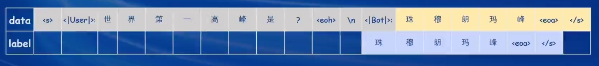

# Lec 4 XTuner: 微调 LLM

## Fine-tune 简介

+ 微调原因：通用大模型 -> 领域内模型
+ 微调范式：
  + 增量预训练：类似于训练的方式，增加领域内知识作为训练集；
  + 指令跟随微调：利用高质量对话、问答数据，让模型获得指令跟随能力。


一条数据的一生：

+ 原始数据：世界最高的山峰是珠穆朗玛峰。
+ 标准格式数据：System、User、Bot三类角色的对话数据。
 
+ 添加对话模板：实际喂给模型的对话数据，让模型区分出不同的角色，拼装过程是由微调框架完成的，只对输出进行损失计算。


+ tokenizer并添加label计算损失。

(label和output需要错开一位，但在transformers库当中，也不需要开发者来做这一步)

## Lora & QLora

核心思想：在原本的Linear层之外，加一个低秩矩阵进行额外的参数学习。


比较：


## XTuner 介绍

使用配置文件的方式封装微调场景（大多数微调框架都是这么做的）


自定义训练方式：


训练完成后，进行对话：


以及内置了若干种数据映射方式，不必纠结于数据和对话模板的拼接。

## XTuner 加速方案

+ Flash Attention：将注意力矩阵的计算划分为分块矩阵的计算，利用GPU不同缓存/内存区域访存时间的差异来加速计算。默认开启。
+ DeepSpeed Zero：将模型、优化器的一部分参数/中间值保存到cpu内存/各个gpu显存上，降低对于单卡的显存要求。自己指定是否开启。

## 图像+文本多模态

核心：将文本、图像的embedding映射到同一个语义空间内。

## 基础作业

首先配置环境

```bash
mkdir -p /root/xtuner0117 && cd /root/xtuner0117

# 拉取 0.1.17 的版本源码
git clone -b v0.1.17  https://github.com/InternLM/xtuner

cd /root/xtuner0117/xtuner

# 从源码安装 XTuner
pip install -e '.[all]'
```

数据集准备：

```bash
mkdir -p /root/ft && cd /root/ft

mkdir -p /root/ft/data && cd /root/ft/data

touch /root/ft/data/generate_data.py

# 生成了许多OpenAI格式的重复微调数据

python /root/ft/data/generate_data.py
```

模型准备：

```bash
mkdir -p /root/ft/model

cp -r /root/share/new_models/Shanghai_AI_Laboratory/internlm2-chat-1_8b/* /root/ft/model/
```

配置文件选择：

```bash
xtuner list-cfg -p internlm2_1_8b

mkdir -p /root/ft/config

# 使用 XTuner 中的 copy-cfg 功能将 config 文件复制到指定的位置
xtuner copy-cfg internlm2_1_8b_qlora_alpaca_e3 /root/ft/config
```

配置文件修改：

+ PART 1 Settings：
  + 修改模型路径、数据集路径为本地路径；
  + 修改训练相关超参数；
+ PART 3 Dataset & Dataloader：
  + 修改数据集格式为OpenAI格式。

模型训练：
```bash
# 指定保存路径
xtuner train /root/ft/config/internlm2_1_8b_qlora_alpaca_e3_copy.py --work-dir /root/ft/train

# 使用 deepspeed 来加速训练
xtuner train /root/ft/config/internlm2_1_8b_qlora_alpaca_e3_copy.py --work-dir /root/ft/train_deepspeed --deepspeed deepspeed_zero2

# 模型续训
xtuner train /root/ft/config/internlm2_1_8b_qlora_alpaca_e3_copy.py --work-dir /root/ft/train --resume /root/ft/train/iter_600.pth
```

注意，实际构建微调数据集的时候，要包括模型预训练的语料，避免模型丢失原始的对话能力。

微调前的情况：


训练300个iter，已经可以学到微调指令的信息：


训练500个iter，回答逐渐变得单一：


600个iter：（好喜欢回答这一句话）


768个iter：（训练完毕，没有什么变化了）


**微调日志**


模型转换，转换成Huggingface格式：

```bash
mkdir -p /root/ft/huggingface

xtuner convert pth_to_hf /root/ft/train/internlm2_1_8b_qlora_alpaca_e3_copy.py /root/ft/train/iter_768.pth /root/ft/huggingface

# 此时，huggingface 文件夹即为我们平时所理解的所谓 “LoRA 模型文件”
```

模型整合，将adapter和原始模型组合成一个模型：
```bash
mkdir -p /root/ft/final_model

# 解决一下线程冲突的 Bug 
export MKL_SERVICE_FORCE_INTEL=1

# 进行模型整合
# xtuner convert merge  ${NAME_OR_PATH_TO_LLM} ${NAME_OR_PATH_TO_ADAPTER} ${SAVE_PATH} 
xtuner convert merge /root/ft/model /root/ft/huggingface /root/ft/final_model
```

对话测试：
```bash
# 注意选择的 prompt_template 要与训练、微调一致
# 微调后
xtuner chat /root/ft/final_model --prompt-template internlm2_chat

# 原始
xtuner chat /root/ft/model --prompt-template internlm2_chat
```

微调后的对话结果：（部署推理时间长，因此没有测试原始模型）


对身份信息的回答极度单一。

Web Demo 部署：
```bash
pip install streamlit==1.24.0

# 创建存放 InternLM 文件的代码
mkdir -p /root/ft/web_demo && cd /root/ft/web_demo

# 拉取 InternLM 源文件
git clone https://github.com/InternLM/InternLM.git

# 进入该库中
cd /root/ft/web_demo/InternLM

# 修改 InternLM/chat/web_demo.py

streamlit run /root/ft/web_demo/InternLM/chat/web_demo.py --server.address 127.0.0.1 --server.port 6006
```

