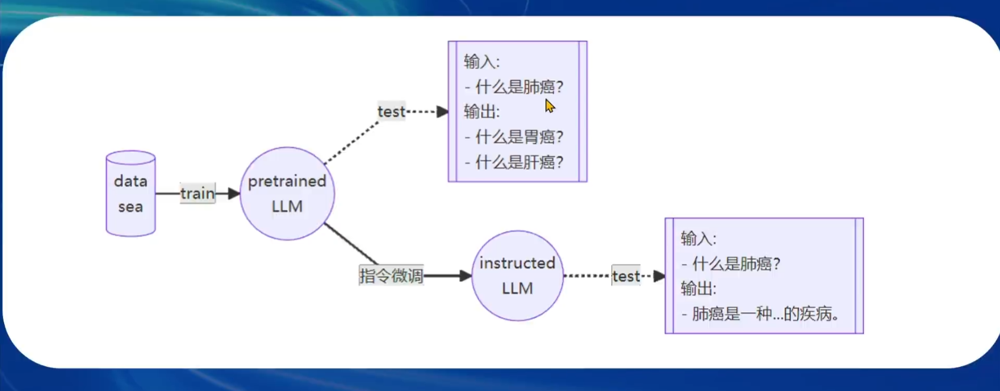
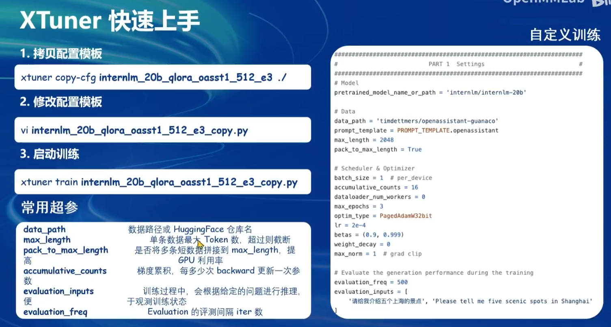

# Lec 4 XTuner: 微调 LLM

## Fine-tune 简介

+ 微调原因：通用大模型 -> 领域内模型
+ 微调范式：
  + 增量预训练：类似于训练的方式，增加领域内知识作为训练集；
  + 指令跟随微调：利用高质量对话、问答数据，让模型获得指令跟随能力。

一条数据的一生：

+ 原始数据：世界最高的山峰是珠穆朗玛峰。
+ 标准格式数据：System、User、Bot三类角色的对话数据。
 
+ 添加对话模板：实际喂给模型的对话数据，让模型区分出不同的角色，拼装过程是由微调框架完成的，只对输出进行损失计算。

+ tokenizer并添加label计算损失。

(label和output需要错开一位，但在transformers库当中，也不需要开发者来做这一步)

## Lora & QLora

核心思想：在原本的Linear层之外，加一个低秩矩阵进行额外的参数学习。

比较：

## XTuner 介绍

使用配置文件的方式封装微调场景（大多数微调框架都是这么做的）

自定义训练方式：

训练完成后，进行对话：

以及内置了若干种数据映射方式，不必纠结于数据和对话模板的拼接。

## XTuner 加速方案

+ Flash Attention：将注意力矩阵的计算划分为分块矩阵的计算，利用GPU不同缓存/内存区域访存时间的差异来加速计算。默认开启。
+ DeepSpeed Zero：将模型、优化器的一部分参数/中间值保存到cpu内存/各个gpu显存上，降低对于单卡的显存要求。自己指定是否开启。

## 图像+文本多模态

核心：将文本、图像的embedding映射到同一个语义空间内。