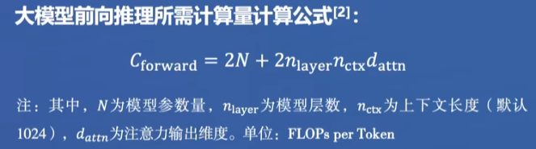
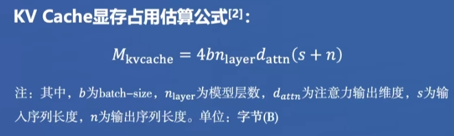
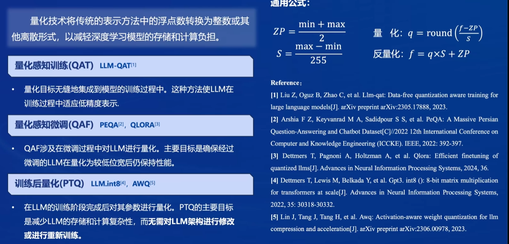
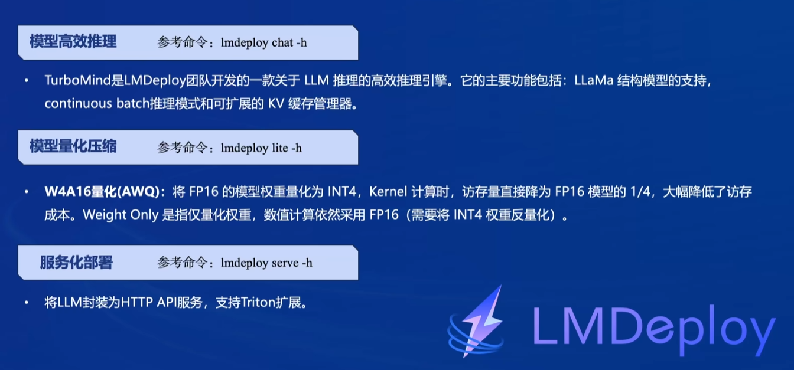
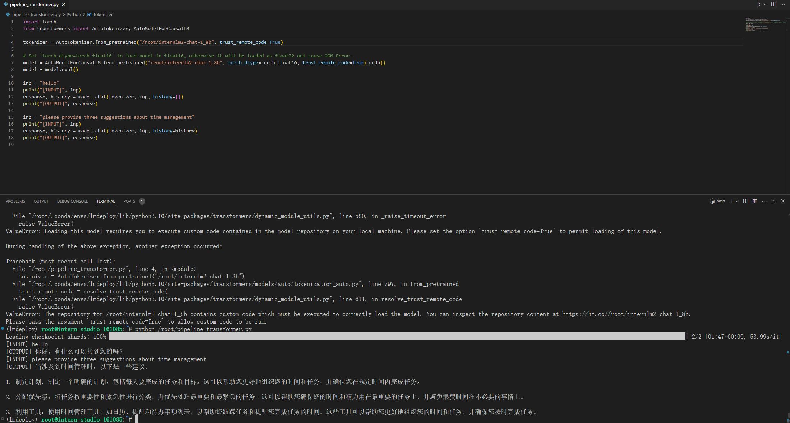
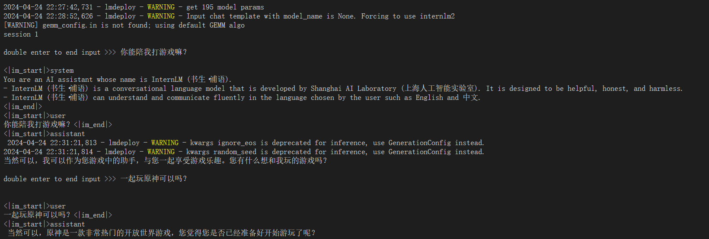

# Lec 5 LMDeploy 量化部署

## 模型部署的困难

+ 计算量大：



+ 内存开销大：



+ 访存开销大：访存密集型任务；

+ 动态请求：生成token越多，消耗的时间越长；

## 部署方案

+ 模型剪枝：移除不必要的参数
  + 非结构化剪枝：根据阈值，将参数置0；
  + 结构化剪枝：保持整体的网络结构，针对整组权重进行移除。
+ 知识蒸馏；
+ 量化（通过降低访存量实现加速）；


## LMDeploy介绍



## 基础作业

启动环境并安装lmdeploy:
```bash
pip install lmdeploy[all]==0.3.0
```

获得模型：
```bash
cd ~
ln -s /root/share/new_models/Shanghai_AI_Laboratory/internlm2-chat-1_8b /root/
```

首先利用transformers pipeline进行推理：



之后利用LMDeploy与模型进行对话：



(推理速度很快，部署的过程真的长hhh)

利用 KV Cache、量化等方式加速推理：

`非基础作业，待完成`