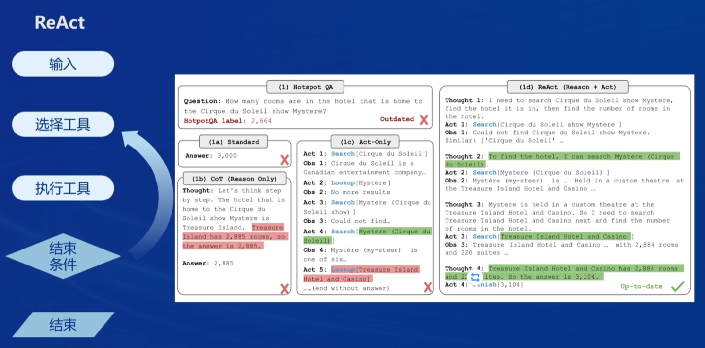

# Lec 6 Lagent & AgentLego 智能体应用搭建

## Agent介绍

产生原因：解决大模型幻觉、时效性、可靠性的问题。

智能体组成：感知、决策、动作。

## 经典智能体架构

+ AutoGPT


+ ReWoo


+ ReAct



## Lagent & AgentLego


二者的联系：


## 基础作业

首先是环境配置以及相关库的安装：

```bash
mkdir -p /root/agent

git clone https://gitee.com/internlm/lagent.git
cd lagent && git checkout 581d9fb && pip install -e . && cd ..
git clone https://gitee.com/internlm/agentlego.git
cd agentlego && git checkout 7769e0d && pip install -e . && cd ..

git clone -b camp2 https://gitee.com/internlm/Tutorial.git
```

### Lagent Web Demo

首先使用 LMDeploy 启动一个 api_server：

```bash
lmdeploy serve api_server /root/share/new_models/Shanghai_AI_Laboratory/internlm2-chat-7b \
                            --server-name 127.0.0.1 \
                            --model-name internlm2-chat-7b \
                            --cache-max-entry-count 0.1
```

启动 Lagent Web Demo:

```bash
cd /root/agent/lagent/examples
streamlit run internlm2_agent_web_demo.py --server.address 127.0.0.1 --server.port 7860
```

在本地进行端口映射并访问 Web 页面：


可以看到，模型能够使用工具搜索相关文献，尽管搜索的文献并不都是相关的。

下面自主实现一个工具类，由模型进行调用：

+ 继承 BaseAction 类
+ 实现简单工具的 run 方法；或者实现工具包内每个子工具的功能
+ 简单工具的 run 方法可选被 tool_api 装饰；工具包内每个子工具的功能都需要被 tool_api 装饰


可以看到，模型正常调用天气查询工具返回了结果。

### 直接使用 Lagentlego

下载demo:

```bash
cd /root/agent
wget http://download.openmmlab.com/agentlego/road.jpg
```

安装目标检测运行时依赖:

```bash
conda activate agent
pip install openmim==0.3.9
mim install mmdet==3.3.0
```

完成并运行工具调用脚本，得到如下结果：


作为智能体的应用：

属于进阶作业，后续完成