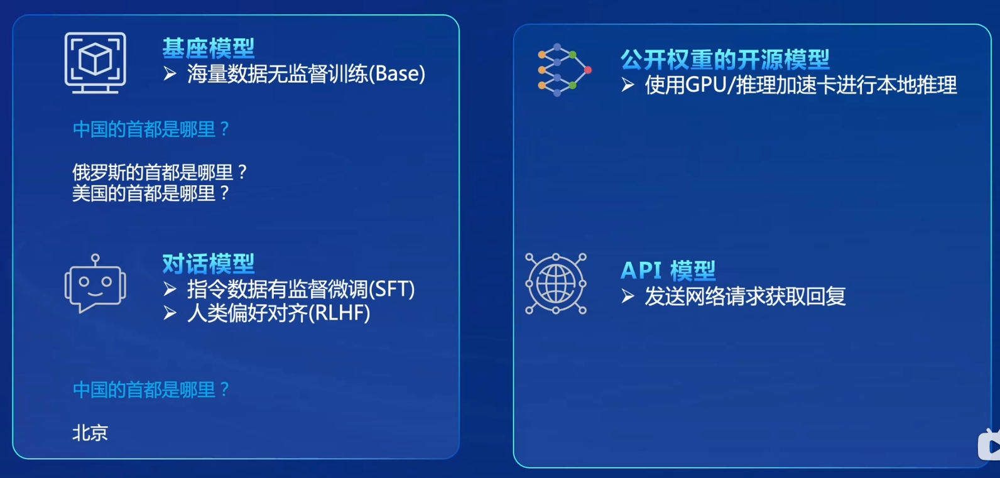
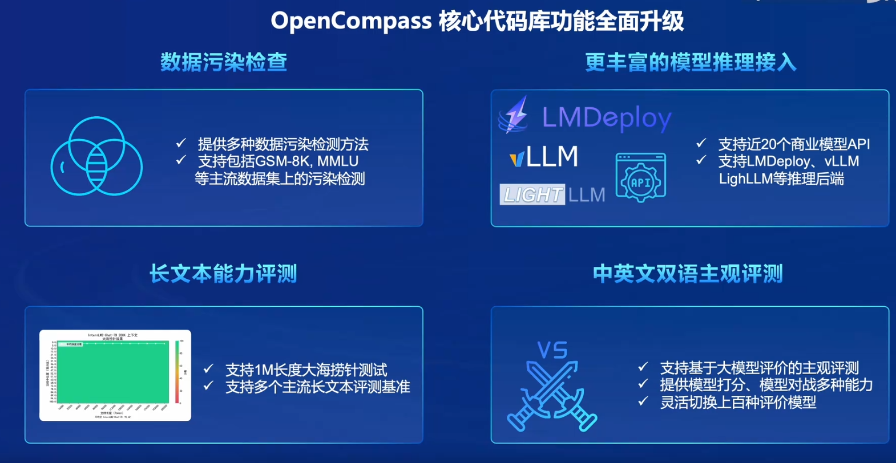

# Lec 7 OpenCompass 大模型评测实战

## 评测面临的挑战

+ 全面性
+ 评测成本
+ 防止数据污染
+ 评测鲁棒性

## 评测方式

+ 不同的模型：



+ 主观评测与客观评测；

+ 提示词工程：让题目变得更好；

+ 长文本评测（大海捞针任务）；

+ 评测全栈工具链：



+ 评测流水线：任务划分，并行完成任务；

+ 进一步发展：针对不同的任务（数学、变成等），制定特定的评测数据集和评测方式。

## 基础作业

首先是环境配置以及安装相关库：

```bash
git clone -b 0.2.4 https://github.com/open-compass/opencompass

cd opencompass
pip install -e .
```

解压评测数据集：

```bash
cp /share/temp/datasets/OpenCompassData-core-20231110.zip /root/opencompass/
unzip OpenCompassData-core-20231110.zip
```

开始评测：

```bash
export MKL_SERVICE_FORCE_INTEL=1

python run.py
--datasets ceval_gen \
--hf-path /share/new_models/Shanghai_AI_Laboratory/internlm2-chat-1_8b \  # HuggingFace 模型路径
--tokenizer-path /share/new_models/Shanghai_AI_Laboratory/internlm2-chat-1_8b \  # HuggingFace tokenizer 路径（如果与模型路径相同，可以省略）
--tokenizer-kwargs padding_side='left' truncation='left' trust_remote_code=True \  # 构建 tokenizer 的参数
--model-kwargs device_map='auto' trust_remote_code=True \  # 构建模型的参数
--max-seq-len 1024 \  # 模型可以接受的最大序列长度
--max-out-len 16 \  # 生成的最大 token 数
--batch-size 2  \  # 批量大小
--num-gpus 1  # 运行模型所需的 GPU 数量
--debug
```